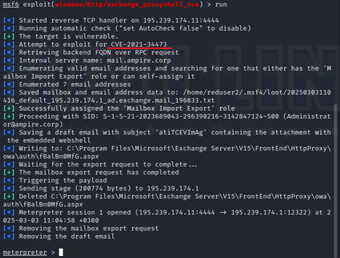

---
## Front matter
title: "Лабораторная работа №2"
subtitle: "Захват почтового сервера"
author:
  - Панченко Д.Д. 1132229056
  - Савурская П.А. 1132222827
  - Кочарян Н.Р. 1132221541
  - Чистякова Д.В. 1132220820

## Generic otions
lang: ru-RU
toc-title: "Содержание"

## Pdf output format
toc: true # Table of contents
toc-depth: 2
lof: false # List of figures
lot: false # List of tables
fontsize: 12pt
linestretch: 1.5
papersize: a4
documentclass: scrreprt
## I18n polyglossia
polyglossia-lang:
  name: russian
  options:
	- spelling=modern
	- babelshorthands=true
polyglossia-otherlangs:
  name: english
## I18n babel
babel-lang: russian
babel-otherlangs: english
## Fonts
mainfont: IBM Plex Serif
romanfont: IBM Plex Serif
sansfont: IBM Plex Sans
monofont: IBM Plex Mono
mathfont: STIX Two Math
mainfontoptions: Ligatures=Common,Ligatures=TeX,Scale=0.94
romanfontoptions: Ligatures=Common,Ligatures=TeX,Scale=0.94
sansfontoptions: Ligatures=Common,Ligatures=TeX,Scale=MatchLowercase,Scale=0.94
monofontoptions: Scale=MatchLowercase,Scale=0.94,FakeStretch=0.9
mathfontoptions:
## Pandoc-crossref LaTeX customization
figureTitle: "Рис."
tableTitle: "Таблица"
listingTitle: "Листинг"
lofTitle: "Список иллюстраций"
lotTitle: "Список таблиц"
lolTitle: "Листинги"
## Misc options
indent: true
header-includes:
  - \usepackage{indentfirst}
  - \usepackage{float} # keep figures where there are in the text
  - \floatplacement{figure}{H} # keep figures where there are in the text
---

# Цель работы

На внешнем периметре расположен почтовый сервер организации, необходимо получить доступ к флагу, расположенному в папке `С:\Windows\system32\`.

# Выполнение лабораторной работы

## Поиск вектора атаки 

Откроем терминал и просканируем подсеть `195.239.174.0/24` для поиска открытых портов, которые можно использовать для атаки (рис. [-@fig:001]).

{#fig:001 width=70%}

В результате сканирования на хосте `195.239.174.1` мы получили открытые порты `25` (порт, предназначенный для передачи электронных писем) и `443` (порт для защищенной связи веб-браузера).

Значит на хосте `195.239.174.1` установлен почтовый сервер.

Убедимся в этом (рис. [-@fig:002]).

{#fig:002 width=70%}

Определим версию Exchange Server для поиска уязвимостей (рис. [-@fig:003], рис. [-@fig:004]).

{#fig:003 width=70%}

{#fig:004 width=70%}

Ищем нужную сборку в документации Microsoft Exchange (рис. [-@fig:005]).

{#fig:005 width=70%}

Для дальнейшего планирования атаки, переходим на сайт CVEdetails (рис. [-@fig:006]).

{#fig:006 width=70%}

Найдем уязвимости, доступные к эксплуатации (рис. [-@fig:007]).

{#fig:007 width=70%}

Изучим детальную информацию об уязвимостях (рис. [-@fig:008], рис. [-@fig:009]).

{#fig:008 width=70%}

{#fig:009 width=70%}

После изучения детальной информации можно убедиться в том, что первая дата раскрытия информации по уязвимости больше даты выпуска сборки атакуемого почтового сервера Microsoft Exchange Server.

Значит, что указанные уязвимости можно эксплуатировать.

Используем инструмент exploit Metasploit для атаки (рис. [-@fig:010], рис. [-@fig:011]).

{#fig:010 width=70%}

{#fig:011 width=70%}

Проведем сканирование с помощью данного модуля (рис. [-@fig:012]).

{#fig:012 width=70%}

Для атаки мы воспользуемся уязвимостью ProxyShell.

## Атака с использованием уязвимости ProxyShell

Воспользуемся модулем `windows/http/exchange_proxyshell_rce` (рис. [-@fig:013]).

{#fig:013 width=70%}

Зададим параметры `lhost` и `rhosts` (рис. [-@fig:014], рис. [-@fig:015]).

{#fig:014 width=70%}

{#fig:015 width=70%}

Запустим модуль ProxyShell и получим meterpeter-сессию. (рис. [-@fig:016]).

{#fig:016 width=70%}

В процессе эксплуатации модуля ProxyShell обнаружена и проэксплуатирована уязвимость CVE-2021-34473.

Воспользуемся командой `cat C:/windows/system32/flag_for_red_team.txt` для нахождения флага (рис. [-@fig:017]).

{#fig:017 width=70%}

# Вывод

В результате выполнения работы мы успешно получили доступ к флагу, расположенному в папке `С:\Windows\system32\`.
