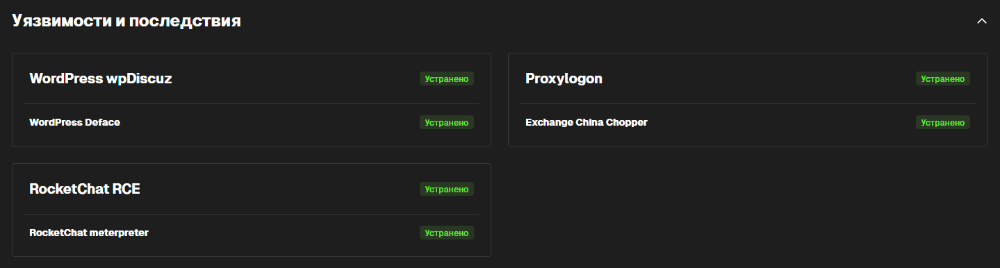

---
## Front matter
title: "Лабораторная работа №3"
subtitle: "Защита корпоративного мессенджера"
author:
  - Панченко Д.Д. 1132229056
  - Савурская П.А. 1132222827
  - Кочарян Н.Р. 1132221541
  - Чистякова Д.В. 1132220820

## Generic otions
lang: ru-RU
toc-title: "Содержание"

## Pdf output format
toc: true # Table of contents
toc-depth: 2
lof: false # List of figures
lot: false # List of tables
fontsize: 12pt
linestretch: 1.5
papersize: a4
documentclass: scrreprt
## I18n polyglossia
polyglossia-lang:
  name: russian
  options:
	- spelling=modern
	- babelshorthands=true
polyglossia-otherlangs:
  name: english
## I18n babel
babel-lang: russian
babel-otherlangs: english
## Fonts
mainfont: IBM Plex Serif
romanfont: IBM Plex Serif
sansfont: IBM Plex Sans
monofont: IBM Plex Mono
mathfont: STIX Two Math
mainfontoptions: Ligatures=Common,Ligatures=TeX,Scale=0.94
romanfontoptions: Ligatures=Common,Ligatures=TeX,Scale=0.94
sansfontoptions: Ligatures=Common,Ligatures=TeX,Scale=MatchLowercase,Scale=0.94
monofontoptions: Scale=MatchLowercase,Scale=0.94,FakeStretch=0.9
mathfontoptions:
## Pandoc-crossref LaTeX customization
figureTitle: "Рис."
tableTitle: "Таблица"
listingTitle: "Листинг"
lofTitle: "Список иллюстраций"
lotTitle: "Список таблиц"
lolTitle: "Листинги"
## Misc options
indent: true
header-includes:
  - \usepackage{indentfirst}
  - \usepackage{float} # keep figures where there are in the text
  - \floatplacement{figure}{H} # keep figures where there are in the text
---

# Цель работы

Защитить корпортивный мессенджер от атаки. Найти и устранить уязвимости и последствия от них.

# Выполнение лабораторной работы

## Уязвимость WordPress wpDiscuz и последствие WordPress Deface

### Обнаружение уязвимости WordPress wpDiscuz

Детектируем эксплуатацию уязвимости CVE-2020-24186 с помощью сетевого сенсора ViPNet IDS NS (рис. [-@fig:001], рис. [-@fig:002]).

{#fig:001 width=70%}

{#fig:002 width=70%}

С помощью «WP Activity Log» проверяем журнал и обнаруживаем авторизацию внешнего пользователя и загрузку файла (рис. [-@fig:003]).

{#fig:003 width=70%}

### Устранение уязвимости WordPress wpDiscuz

Закрытие уязвимости можно осуществить с помощью отключения плагина WpDiscuz. Для отключения плагина в панели инструментов заходим в раздел «Plugins» и далее отключаем нужный плагин (рис. [-@fig:004]).

{#fig:004 width=70%}

Данная нагрузка заключается в том, что нарушитель устанавливает shell сессию с уязвимой машиной. Для обнаружения meterpreter-сессии проверим сокеты уязвимой машины на подключение с помощью утилиты `ss` (рис. [-@fig:005]).

{#fig:005 width=70%}

Для закрытия вредоносного сокета завершим процесс с помощью команды `kill` (рис. [-@fig:006]).

{#fig:006 width=70%}

Уязвимость WordPress wpDiscuz устранена (рис. [-@fig:007]).

{#fig:007 width=70%}

### Устранение последствия WordPress Deface

Данная нагрузка подразумевает изменение внешнего вида сайта путем изменения главной страницы сайта на картинку «hacked» (рис. [-@fig:008]).

{#fig:008 width=70%}

Для нейтрализации данной нагрузки сформируем backup с помощью плагина Updraft Backup/Restore (рис. [-@fig:009]).

{#fig:009 width=70%}

Выберем самую последнию резервную копию и проведем восстановление (рис. [-@fig:010]).

{#fig:010 width=70%}

Последствие «Deface» веб-интерфейса успешно устранено (рис. [-@fig:011]).

{#fig:011 width=70%}

## Уязвимость RocketChat RCE и последствие RocketChat meterpreter

### Обнаружение уязвимости RocketChat RCE

Детектируем скачивание вредоносного файла в формате «.elf» для установки TCP-соединения (рис. [-@fig:012]).

{#fig:012 width=70%}

После восстановления пароля администратора (см. следующий пункт) в веб-интерфейсе RocketChat можем увидеть добавленные сценарии (рис. [-@fig:013], рис. [-@fig:014]).

{#fig:013 width=70%}

{#fig:014 width=70%}

### Устранение уязвимости RocketChat RCE

Для восстановления доступа к аккаунту администратора сбросим пароль. Письмо с инструкциями для сброса пароля читаем в файле `/var/mail/admin` (рис. [-@fig:015], рис. [-@fig:016])

{#fig:015 width=70%}

{#fig:016 width=70%}

Переходим по ссылке и вводим новый пароль. Также для учетной записи администратора настроена двухфакторная аутентификация, воспользуемся кодами восстановления, которые записаны в файле `/home/user/backup_codes` (рис. [-@fig:017], рис. [-@fig:018]).

{#fig:017 width=70%}

{#fig:018 width=70%}

Включим обязательный второй фактор для всех пользователей. Зайдем в «Администрирование», выберем роль и активируем параметр «Пользователи должны использовать двухфакторную аутентификацию» (рис. [-@fig:019]).

{#fig:019 width=70%}

Настроим автоматическое подтверждение почты во вкладке «Администрирование» (рис. [-@fig:020]).

{#fig:020 width=70%}

Настроим автоматическую двухфакторную аутентификацию по электронной почте для новых пользователей во вкладке «Администрирование» (рис. [-@fig:021]).

{#fig:021 width=70%}

Вторая NoSQL инъекция для повышения привилегий использует высокоуровневый оператор БД `$where`, то отключим выполнения JavaScript на стороне сервера базы данных. Для этого отредактируем файл конфигурации БД `/etc/mongod.conf` (рис. [-@fig:022]).

{#fig:022 width=70%}

Для применения настроек перезапустим службу (рис. [-@fig:023]).

{#fig:023 width=70%}

Уязвимость RocketChat RCE устранена (рис. [-@fig:024]).

{#fig:024 width=70%}

### Устранение последствия RocketChat meterpreter

Для устранения meterpreter-сессии сначала выполним команду `ss -tp` для обнаружения активных соединений, а после командой `sudo kill` завершим процесс, устанавливающий соединение с хостом злоумышленника (рис. [-@fig:025], рис. [-@fig:026]).

{#fig:025 width=70%}

{#fig:026 width=70%}

Последствие RocketChat meterpreter успешно устранено (рис. [-@fig:027]).

{#fig:027 width=70%}

## Уязвимость Proxylogon и последствие Exchange China Chopper

### Обнаружение уязвимости Proxylogon

С помощью ViPNet IDS NS обнаруживаем несколько событий, которые связаны с эксплуатацией уязвимости Proxylogon (рис. [-@fig:028]).

{#fig:028 width=70%}

### Устранение уязвимости Proxylogon

Во время эксплуатации уязвимости Proxylogon нарушитель совершает GET и POST запросы к `/ecp`. Ограничим доступ к директории, чтобы уязвимость не эксплуатировалась, с помощью Internet Information Services Manager (рис. [-@fig:029], рис. [-@fig:030]).

{#fig:029 width=70%}

{#fig:030 width=70%}

Также обнаруживаем meterpreter-сессию нарушителя с уязвимым сервером при помощи утилиты `netstat` с ключами `-b` и `-o` (рис. [-@fig:031]).

{#fig:031 width=70%}

Завершим meterpreter-сессию нарушителя с уязвимым сервером (рис. [-@fig:032], рис. [-@fig:033]).

{#fig:032 width=70%}

{#fig:033 width=70%}

Уязвимость Proxylogon устранена (рис. [-@fig:034]).

{#fig:034 width=70%}

### Устранение последствия Exchange China Chopper

Backdoor China Chopper установлен в самую очевидную для таких атак директорию. Находим его в `С:\ProgramFiles\Microsoft\Exchange Server\V15\FrontEnd\HttpProxy\owa\auth\AM_backdoor.aspx` (рис. [-@fig:035]).

{#fig:035 width=70%}

Для устранения нагрузки Backdoor China Chopper удаляем файл веб-оболочки и завершаем meterpreter-сессию, что уже было сделано в предыдущем пункте (рис. [-@fig:036]).

{#fig:036 width=70%}

Последствие Exchange China Chopper успешно устранено (рис. [-@fig:037]).

{#fig:037 width=70%}

# Вывод

В результате выполнения работы мы успешно устранили три уязвимости и три последствия (рис. [-@fig:038]):  
1) Уязвимость WordPress wpDiscuz и последствие WordPress Deface;  
2) Уязвимость RocketChat RCE и последствие RocketChat meterpreter;  
3) Уязвимость Proxylogon и последствие Exchange China Chopper.

{#fig:038 width=70%}