---
## Front matter
title: "Лабораторная работа №5"
subtitle: "Атака ATI на протокол SS7"
author:
  - Панченко Д.Д. 1132229056
  - Савурская П.А. 1132222827
  - Кочарян Н.Р. 1132221541
  - Чистякова Д.В. 1132220820

## Generic otions
lang: ru-RU
toc-title: "Содержание"

## Pdf output format
toc: true # Table of contents
toc-depth: 2
lof: false # List of figures
lot: false # List of tables
fontsize: 12pt
linestretch: 1.5
papersize: a4
documentclass: scrreprt
## I18n polyglossia
polyglossia-lang:
  name: russian
  options:
	- spelling=modern
	- babelshorthands=true
polyglossia-otherlangs:
  name: english
## I18n babel
babel-lang: russian
babel-otherlangs: english
## Fonts
mainfont: IBM Plex Serif
romanfont: IBM Plex Serif
sansfont: IBM Plex Sans
monofont: IBM Plex Mono
mathfont: STIX Two Math
mainfontoptions: Ligatures=Common,Ligatures=TeX,Scale=0.94
romanfontoptions: Ligatures=Common,Ligatures=TeX,Scale=0.94
sansfontoptions: Ligatures=Common,Ligatures=TeX,Scale=MatchLowercase,Scale=0.94
monofontoptions: Scale=MatchLowercase,Scale=0.94,FakeStretch=0.9
mathfontoptions:
## Pandoc-crossref LaTeX customization
figureTitle: "Рис."
tableTitle: "Таблица"
listingTitle: "Листинг"
lofTitle: "Список иллюстраций"
lotTitle: "Список таблиц"
lolTitle: "Листинги"
## Misc options
indent: true
header-includes:
  - \usepackage{indentfirst}
  - \usepackage{float} # keep figures where there are in the text
  - \floatplacement{figure}{H} # keep figures where there are in the text
---

# Цель работы

Произошел инцидент, связанный с утечкой конфиденциальной информации о передвижениях и активности ключевых политиков. Нужно найти уязвимость и устранить её.

# Выполнение лабораторной работы

## Уязвимость SS7 AnyTimeInterrogation и последствие SS7 ATI payload

### Обнаружение атаки

Мы имеем следющую схему шаблона (рис. [-@fig:001]).

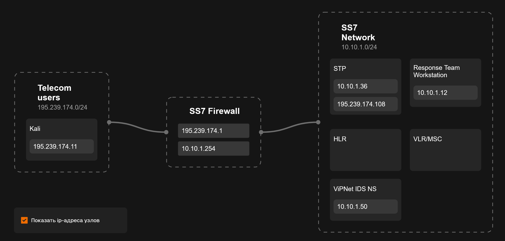{#fig:001 width=70%}

На схеме мы видим, что файрвол протокола SS7 находится по адресу `10.10.1.254`.

Перейдя по этому адресу, мы подключаемся к инструменту pfsense (рис. [-@fig:002]).

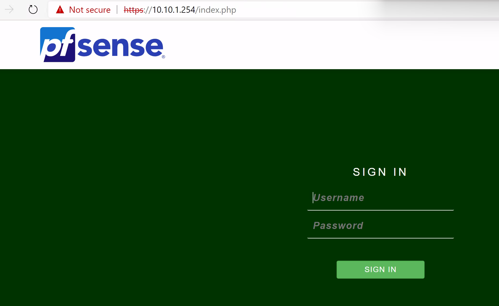{#fig:002 width=70%}

Логин и пароль от сервиса мы находим в утилите KeePass (рис. [-@fig:003], рис. [-@fig:004]).

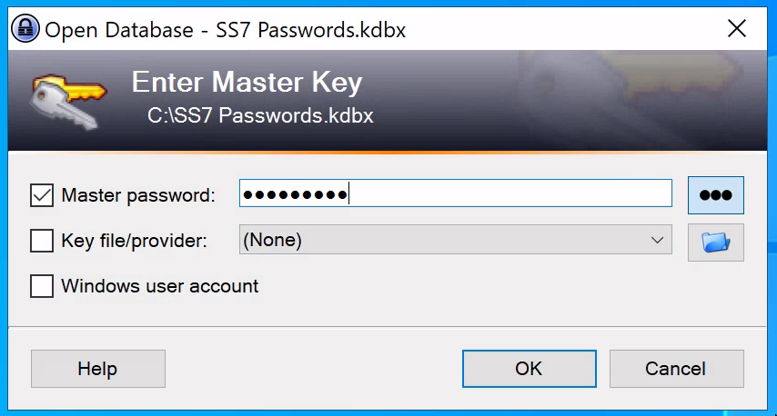{#fig:003 width=70%}

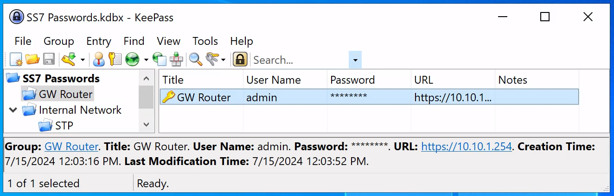{#fig:004 width=70%}

После ввода данных мы попадаем в дашборд с логами файрвола (рис. [-@fig:005]).

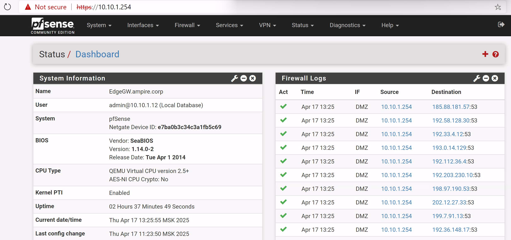{#fig:005 width=70%}

Для дальнейшего диагностирование мы переходим во вкладку "Diagnostics" - "Packet Capture" (рис. [-@fig:006]).

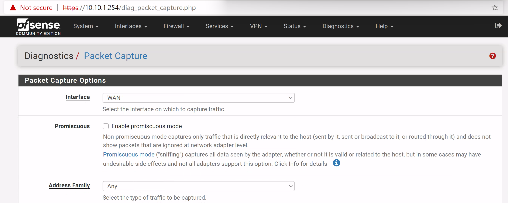{#fig:006 width=70%}

С помощью данного инструмента мы проанализируем весь трафик (рис. [-@fig:007]).

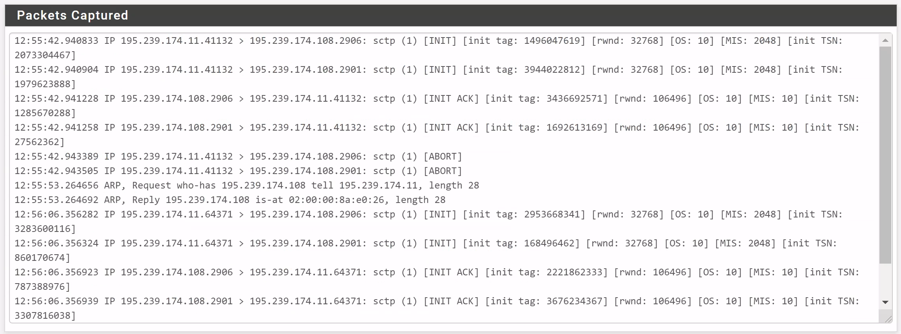{#fig:007 width=70%}

После анализа трафика мы обнаружили два необычных ip-адреса: `195.239.174.108` и `195.239.174.11`.

После просмотра схемы шаблона мы понимаем, что ip `195.239.174.108` - это STP SS7, то есть точка передачи сигнала (узел), который направляет сигнальные сообщения в сети SS7. Этот ip не представляет никакой угрозы для нас.

Остался ip `195.239.174.11`, с ним и будем работать.

### Устранение атаки

Для устранения атаки мы подключаемся к машине с тем самым STP SS7 через утилиту PuTTY (рис. [-@fig:008]).

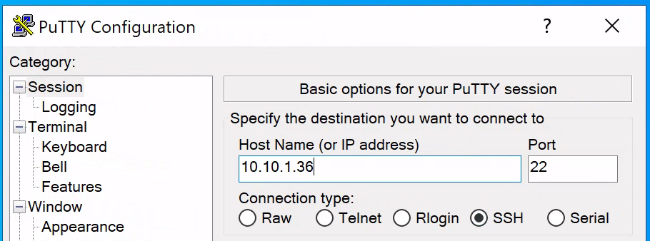{#fig:008 width=70%}

Логин и пароль от машины мы берем в утилите KeePass (рис. [-@fig:009]).

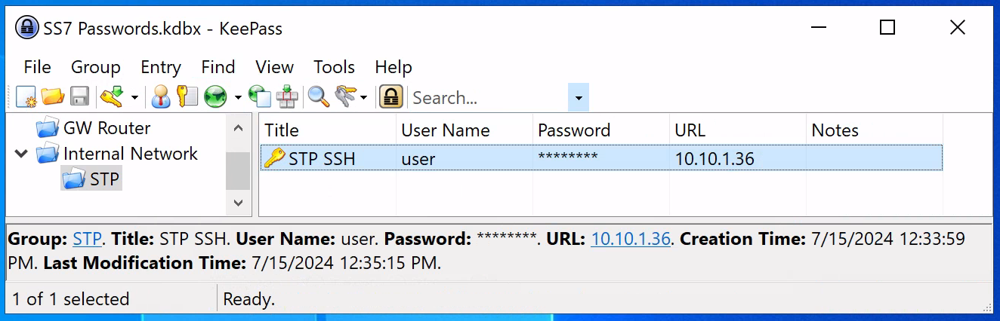{#fig:009 width=70%}

С помощью этих данных подключаемся к виртуальной машине (рис. [-@fig:010]).

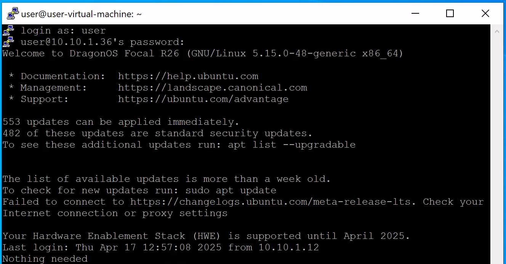{#fig:010 width=70%}

Теперь проверим настройки файрвола с помощью команды `sudo iptables -L -v` (рис. [-@fig:011]).

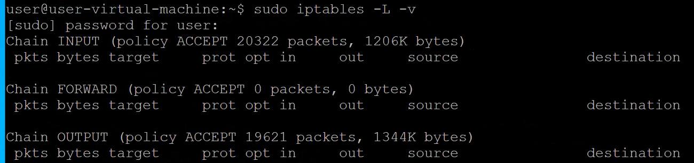{#fig:011 width=70%}

В файрволе не задано никаких условий.

Для устранения атаки запретим подключение с атакующего ip-адреса `195.239.174.11` (рис. [-@fig:012]).

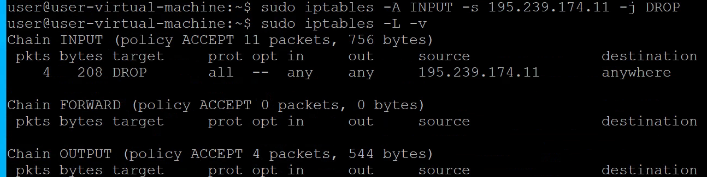{#fig:012 width=70%}

После этих действий уязвимость и последствие успешно устранены (рис. [-@fig:013], рис. [-@fig:014]).

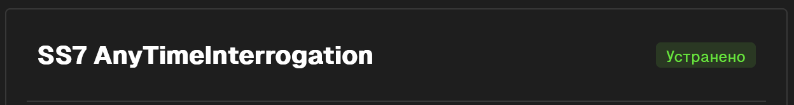{#fig:013 width=70%}

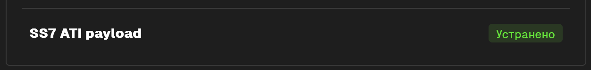{#fig:014 width=70%}

# Вывод

В результате выполнения работы мы успешно устранили уязвимость SS7 AnyTimeInterrogation и последствие SS7 ATI payload (рис. [-@fig:015]).

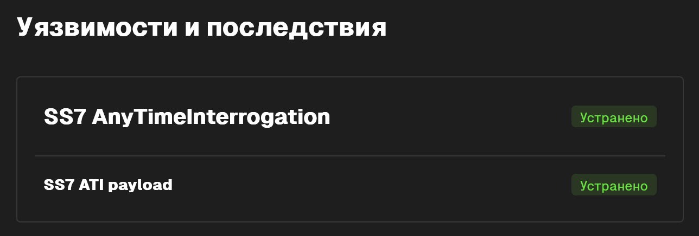{#fig:015 width=70%}